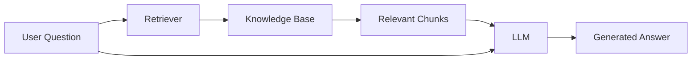
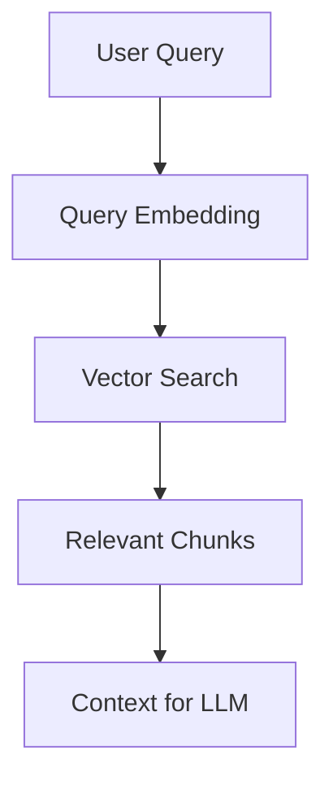

# Retrieval-Augmented Generation (RAG)

## What is RAG?

Retrieval-Augmented Generation, commonly called RAG, is an AI architecture designed to improve the quality of responses generated by large language models. Instead of forcing the model to rely only on the information stored inside its parameters during training, RAG allows the model to retrieve external information before producing an answer.

In simple terms, a RAG system first searches for relevant knowledge and then uses that knowledge to generate a response.

The idea can be represented as:

```text
User Question → Retrieve Information → Generate Answer
```

This architecture became important because modern language models are powerful at generating text but are not always reliable when answering questions that require current, domain-specific, or factual information.

---

# Why Was RAG Introduced?

Large language models are trained on massive datasets, but they still face several limitations. One major issue is that their knowledge is frozen after training. If new information appears after the training period, the model cannot naturally know it.

Another problem is hallucination, where the model confidently generates incorrect information. This happens because the model predicts statistically likely text rather than verifying facts from a trusted source.

RAG was introduced to solve these problems by connecting language models with external knowledge systems such as documents, databases, PDFs, websites, or research papers.

Instead of answering purely from memory, the model can now search relevant information before generating a response.

---

# How Does a RAG System Actually Work?

A RAG system works in two major stages: retrieval and generation.

During retrieval, the system searches a knowledge source and finds the most relevant pieces of information related to the user's question.

During generation, the retrieved information is inserted into the prompt so that the language model can produce a grounded answer.

The complete workflow looks like this:



The retriever behaves like a search engine, while the language model behaves like a reasoning and generation engine.

---

# What Is the Knowledge Base in RAG?

The knowledge base is the external source of information that the system searches during retrieval.

This knowledge base may contain company documents, textbooks, research papers, support tickets, websites, databases, or private enterprise data.

Unlike traditional language models, RAG systems do not need to memorize all information during training because they can dynamically access it when needed.

For example, if a company builds an internal chatbot, the knowledge base may contain employee manuals and organizational policies.

---

# Why Are Documents Split Into Chunks?

Documents are usually large, but embedding models and retrieval systems work better with smaller sections of text. Because of this, documents are divided into smaller segments called chunks.

Chunking improves retrieval accuracy because the retriever can focus on smaller, semantically meaningful sections rather than entire documents.

For example, a 50-page research paper may be divided into hundreds of smaller chunks containing individual concepts or explanations.

This process can be visualized as:

```text
Large Document
      ↓
Smaller Chunks
      ↓
Embeddings
      ↓
Vector Database
```

Choosing chunk size is extremely important. Very small chunks may lose context, while very large chunks may reduce retrieval precision.

---

# What Are Embeddings and Why Are They Important?

Embeddings are numerical vector representations of text. They convert language into mathematical form so that machines can compare meanings.

For example, the sentence:

```text
"Deep learning improves computer vision."
```

may become:

```text
[0.21, -0.83, 0.44, ...]
```

These vectors capture semantic meaning rather than exact wording. This means two sentences with similar meanings may produce vectors that are close together in vector space even if the words are different.

Because of embeddings, a query about “training neural networks” may successfully retrieve a chunk discussing “deep learning optimization.”

This semantic understanding is one of the most important foundations of modern RAG systems.

---

# What Is a Vector Database?

After embeddings are created, they must be stored somewhere for efficient retrieval. This storage system is called a vector database.

A vector database is optimized for similarity search. Instead of searching by exact keywords, it searches by vector closeness.

Popular vector databases include:

- FAISS
- Pinecone
- Chroma
- Weaviate
- Milvus

When a user asks a question, the query is also converted into an embedding, and the vector database searches for chunks with similar vector representations.

---

# How Does Retrieval Happen?

Retrieval begins when the user submits a query.

First, the query is transformed into an embedding vector. Then the system compares this vector against stored document vectors inside the vector database.

The database returns the most semantically relevant chunks.

This process is known as similarity search or semantic retrieval.

The retrieval pipeline can be represented as:



The retrieved chunks act as supporting evidence for the final response.

---

# What Happens During Generation?

Once relevant chunks are retrieved, they are inserted into the prompt given to the language model.

The model now generates a response using both:

1. The user’s question
2. The retrieved contextual information

For example:

```text
Context:
TrackNet is a heatmap-based deep learning model
used for ball tracking in sports videos.

Question:
What is TrackNet?
```

The language model then generates:

```text
TrackNet is a deep learning architecture designed
for tracking balls in sports videos using heatmaps.
```

Without retrieval, the model might hallucinate or provide incomplete information.

---

# Why Is RAG Better Than Pure LLM Systems?

Pure language models depend entirely on internal memory. This creates several issues including outdated knowledge, hallucinations, and inability to access private information.

RAG solves these problems by grounding answers in retrieved documents.

This makes responses:

- More factual
- More explainable
- More up-to-date
- More domain-aware

Instead of memorizing everything, the model learns how to search and use relevant information effectively.

---

# Does RAG Eliminate Hallucinations Completely?

No, RAG reduces hallucinations but does not completely remove them.

Even if correct context is retrieved, the language model may still misinterpret information or generate unsupported conclusions.

Because of this, production-grade RAG systems often include additional verification layers such as:

- Re-ranking systems
- Citation checking
- Response validation
- Guardrails

The quality of retrieval strongly affects the quality of generation.

---

# What Is Hybrid Retrieval?

Traditional retrieval systems used keyword matching techniques such as TF-IDF or BM25. Modern RAG systems often use dense retrieval based on embeddings.

Hybrid retrieval combines both approaches.

This means the system uses:

- Semantic similarity from embeddings
- Exact keyword matching from classical search

Hybrid systems are generally more robust because they combine semantic understanding with precise keyword retrieval.

---

# What Are Some Advanced RAG Techniques?

As RAG systems evolved, researchers introduced more advanced architectures to improve retrieval quality and reasoning ability.

One important technique is query expansion, where the original query is rewritten into multiple variations to improve retrieval coverage.

Another method is re-ranking, where retrieved chunks are reordered using a secondary model that better estimates relevance.

Parent-child retrieval retrieves smaller chunks but returns larger parent sections to preserve context.

Agentic RAG goes even further by allowing AI agents to decide when retrieval is needed, what to retrieve, and whether additional searches should occur.

These improvements make modern RAG systems significantly more powerful than basic retrieval pipelines.

---

# How Is RAG Different From Fine-Tuning?

Fine-tuning changes the internal parameters of a model by retraining it on new data. RAG does not retrain the model. Instead, it provides external knowledge dynamically during inference.

Fine-tuning is useful when behavior or style must change permanently, while RAG is useful when knowledge changes frequently.

For example, a news assistant benefits more from RAG because news changes every day.

A customer-support chatbot for company policies also benefits from RAG because documents can be updated without retraining the model.

---

# Where Is RAG Used in Real Applications?

RAG is widely used in modern AI systems because it allows models to interact with real-world knowledge sources.

Applications include:

- Enterprise chatbots
- Research assistants
- AI coding assistants
- Medical document systems
- Legal search systems
- Customer-support agents

Many modern AI products use some form of retrieval system internally because it improves factual grounding and reduces hallucination risk.

---

# What Is the Most Important Insight About RAG?

The most important insight is that RAG does not make the language model smarter internally.

Instead, it gives the model access to relevant external knowledge at inference time.

A useful analogy is:

```text
LLM = Student
Retriever = Library Search
Vector Database = Library
```

Instead of answering purely from memory, the student first searches the library and then constructs an informed answer.

This fundamentally changes how AI systems interact with information.

---

# Final Understanding

Retrieval-Augmented Generation is one of the most important architectures in modern AI because it combines information retrieval with natural language generation.

Rather than depending only on memorized training data, RAG systems dynamically search external knowledge and use it to produce grounded responses.

This architecture enables AI systems to become more reliable, more explainable, and more adaptable to real-world information.

In modern AI engineering, understanding RAG is essential because it forms the foundation of many production-grade AI assistants and enterprise systems.
